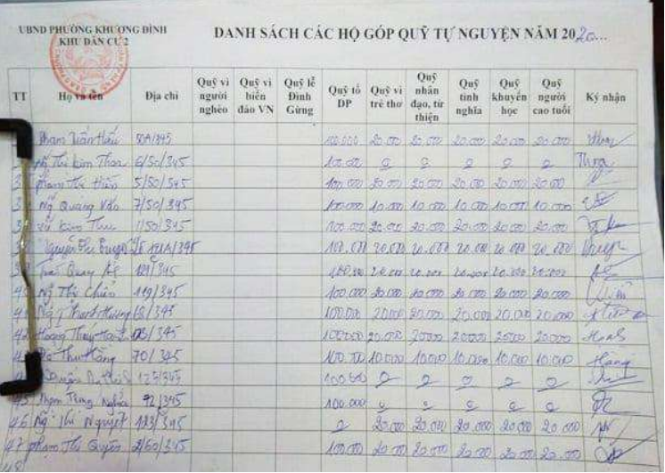

# CNPM_project
GIỚI THIỆU BÀI TOÁN
Chung cư BlueMoon tọa lạc ngay ngã tư Văn Phú được khởi công xây dựng năm 2021
và hoàn thành vào 2023. Chung cư được xây dựng trên diện tích 450m2, gồm 30 tầng,
tầng 1 làm kiot, 4 tầng đế, 24 tầng nhà ở và 1 tầng penhouse. Khi sở hữu nhà chung cư,
hộ gia đình hoặc chủ sở hữu sẽ phải bỏ ra một khoản kinh phí đóng định kỳ để thực
hiện vận hành và bảo dưỡng thường xuyên về cơ sở vật chất. Các hoạt động quản lý và
thu phí ở chung cư BlueMoon được thực hiện bởi Ban quản trị chung cư do nhân dân
sinh sống ở đây bầu ra.
Hàng tháng Ban quản trị chung cư lập danh sách các khoản phí cần đóng với
mỗi hộ gia đình và gửi thông báo thu tiền. Các khoản phí chung cư gồm nhiều loại:
+ Phí dịch vụ chung cư, đây là loại phí bắt buộc nộp theo tháng, ban quản lý
chung cư để chi trả vào các việc như: Lau dọn vệ sinh và bảo dưỡng các khu vực chung,
làm đẹp cảnh quan của các khu vực chung; thu gom rác thải, bảo dưỡng sân vườn; đảm
bảo an ninh... Phí dịch vụ chung cư được tính theo diện tích căn hộ sở hữu, hiện nay
dao động từ 2.500 đồng tới 16.500 đồng/m2/tháng.
+ Phí quản lý chung cư, đây cũng là chi phí bắt buộc nộp theo tháng, dùng cho
tất cả các hoạt động quản lý cũng như vận hành nhà chung cư. Chi phí này phụ thuộc
vào tiêu chuẩn, chất lượng của dự án chung cư đó ví dụ như chung cư cao cấp, chung
cư thường hay nhà chung cư giá rẻ. Với chung cư BlueMoon phí quản lý ở mức từ
7.000 đồng/m2.
+ Các khoản đóng góp mà ban quản trị phối hợp với chính quyền địa phương, tổ
dân phố để thực hiện thu (ví dụ quỹ vì người nghèo, quỹ biển đảo, quỹ từ thiện,...). Các
khoản đóng góp này thu theo từng đợt, không bắt buộc và thu theo tinh thần tự nguyện.
Ban quản trị hiện đang quản lý việc thu phí theo phương thức thủ công, có sử
dụng một số công cụ hỗ trợ như Excel nhưng hiệu quả quản lý chưa cao. Hiện tại Ban
quản trị có nhu cầu xây dựng một phần mềm quản lý thu các loại phí tại chung cư
BlueMoon.
Ví dụ một mẫu sổ quản lý thu các khoản đóng góp:

Trong phiên bản v1.0 của phần mềm, các chức năng cơ bản cần xây dựng cho Ban
quản trị bao gồm: quản lý thông tin các khoản thu phí đóng góp, quản lý thu phí của
các hộ gia đình. Ngoài ra phần mềm cũng cần cung cấp chức năng tra cứu, tìm kiếm
và một số thông tin thống kê cơ bản giúp Ban quản trị nắm được hiện trạng các khoản
thu. Nhằm giúp cho các hoạt động quản lý khác ở chung cư được thuận tiện và thông
suốt, Ban quản trị muốn xây dựng thêm các chức năng quản lý thông tin cơ bản về các
hộ gia đình (hộ khẩu) và nhân dân (nhân khẩu) đang sinh sống tại BlueMoon. Các chức
năng này giúp Ban quản trị có thể cung cấp thông tin (chi tiết về hộ gia đình, nhân khẩu
trong hộ, các hoạt động biến đổi nhân khẩu, tạm vắng, tạm trú,...) cho cơ quan chức
năng khi được yêu cầu. Các chức năng này chỉ truy cập được sau khi Ban quản trị đăng
nhập thành công với tài khoản đã cung cấp. Ban quản trị cũng có thể quản lý các thông
tin cá nhân và thay đổi mật khẩu đăng nhập.
Trong phiên bản v2.0 phát triển tiếp theo của phần mềm, Ban quản trị muốn xây
dựng thêm chức năng quản lý các khoản thu: Phí gửi xe ở chung cư: thu từng tháng 
theo thông tin phương tiện đăng ký của hộ gia đình, trong đó phí gửi xe máy hàng tháng
là 70.000/xe/một tháng và phí gửi ô tô là 1.200.000 nghìn đồng/xe/một tháng. Chi phí
điện, nước, internet, đây là các khoản phí mà Ban quản trị thu hộ từng tháng theo thông
báo từ các công ty cung cấp dịch vụ tương ứng.
Phần mềm dự kiến được phát triển dưới dạng một ứng dụng desktop với công nghệ
Java, dữ liệu của phần mềm được lưu trữ tập trung trên MySQL server.
Luồng nghiệp vụ cần xử lý:
1. Đăng kí tài khoản
2. Tạo khoản thu
3. Thu phí
4. Thống kê các khoản đóng góp